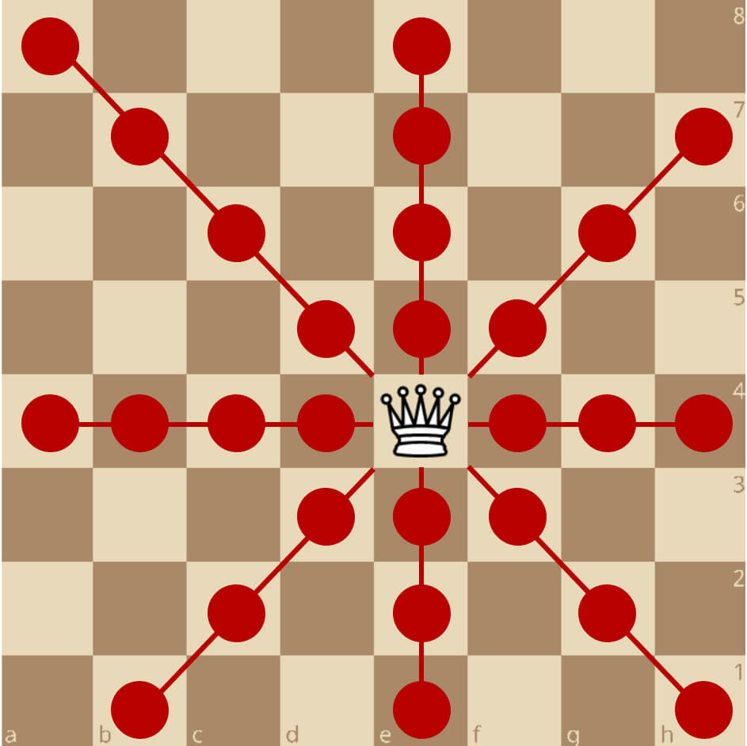
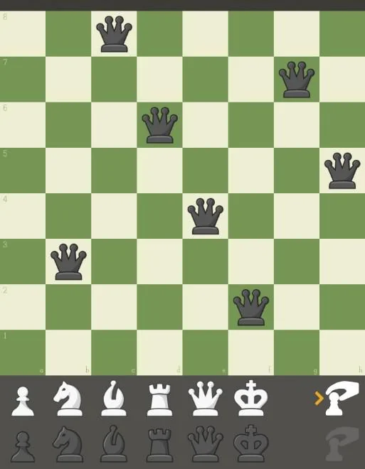

# Problem Description
N-Queens problem consists of placing N queens on an NxN chessboard such that no two queens attack each other.
Queens should be placed such that there is no more than one queen on a row / column / diagonal.

Check the illustration below:

<div style="display: flex; justify-content: center;">
  
</div>


# Algorithm
A common solution to solve the N-Queens problem is backtracking.

How I would think about it:
- Place the first queen at a random position
- Attempt to place to other queen at a random position
- If any of the queens can attack each other on the chessboard, move the second queen to another position until they cannot attack each other. Else, leave in same positions
- Repeat

- Constraints:
. queen at same position
. queen at same row
. queen at same col
. queen at same diagonal

- Algorithm:
. populate the matrix with 0's (no queens)
. place a queen in a random position
. place other queen in a position that satisfies the constraint
. recursively solve all the rest

# Steps
- solution(N) -> NxN (1 for queen, 0 for no queen)
- draw(NxN)

The illustration below shows an example output for a 8x8 chessboard:

<div style="display: flex; justify-content: center;">
  
</div>


# Tools
- C++
- RayLib library for rendering chessboard
- linux terminal


# Setup
Follow these steps to install RayLib which will be used as the graphics library for rendering the chessboard solved:

. Open your wsl terminal

. update package lists
```bash
sudo apt update
```

. Install build tools, git, and raylib dependencies
```bash
sudo apt install build-essential git cmake \
libasound2-dev mesa-common-dev libx11-dev \
libxrandr-dev libxi-dev xorg-dev libgl1-mesa-dev \
libglu1-mesa-dev -y
```

. Clone RayLib
```bash
git clone https://github.com/raysan5/raylib.git
cd raylib/src
```

. Compile and install
```bash
make PLATFORM=PLATFORM_DESKTOP
sudo make install
```


# Instructions
. Compile the .cpp files against the RayLib library
```bash
make
```

. Remove .o files
```bash
make clean
```

. Run the executable, make sure to give the program an integer argument between 4 and 50, which will determine the width and height of the chessboard
```bash
./main <value>
```

. Test the program with different arguments

. Remove the executable
```bash
make fclean
```