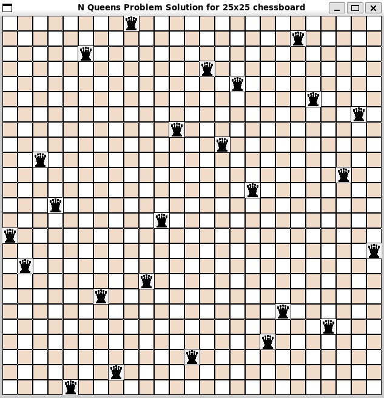

# N Queens Problem - O(n³) Algorithm

## Outline
1. [Problem Description](#problem-description)
2. [Algorithm](#algorithm)
3. [Code Structure](#code-structure)
4. [Tools and Technologies](#tools-and-technologies)
5. [Setup](#setup)
6. [Instructions](#instructions)
7. [AI Usage](#ai-usage)

## Problem Description
The N-Queens problem consists of placing N queens on an NxN chessboard such that no two queens attack each other. Queens should be placed such that there is no more than one queen on a row, column, or diagonal.

Check the illustration below:

<div style="display: flex; justify-content: center;">
  
</div>


## Algorithm
A common solution to solve the N-Queens problem is backtracking. However, the complexity in the worst case can reach O(n!). 

Our adapted algorithm provides a complexity of O(n³), which represents a massive improvement over the common backtracking solution. Instead of exhaustively exploring all possible placements and their combinations, our approach uses a randomized method with constraint checking to find valid positions more efficiently.

Constraints:

. queen at same position

. queen at same row

. queen at same col

. queen at same diagonal

- Algorithm flow:

. populate the matrix with 0's (no queens)

. for all the N queens:

- Keep generating a random position until constraints are satisfied
- put the queen in its place

In case the maximum attempt is reached without finding a valid solution, the algorithm will restart from 0


## Code Structure
- `solution(N)` -> NxN matrix (1 for queen, 0 for no queen)
- `draw(NxN)` -> Visualizes the solution on the chessboard

The illustration below shows an example output for a 25x25 chessboard:

<div style="display: flex; justify-content: center;">
  
</div>


## Tools and Technologies
- **Language**: C++
- **Graphics Library**: RayLib for rendering chessboard
- **Development Environment**: Linux terminal (WSL)


## Setup
Follow these steps to install RayLib which will be used as the graphics library for rendering the chessboard solved:

. Open your wsl terminal

. update package lists
```bash
sudo apt update
```

. Install build tools, git, and raylib dependencies
```bash
sudo apt install build-essential git cmake \
libasound2-dev mesa-common-dev libx11-dev \
libxrandr-dev libxi-dev xorg-dev libgl1-mesa-dev \
libglu1-mesa-dev -y
```

. Clone RayLib
```bash
git clone https://github.com/raysan5/raylib.git
cd raylib/src
```

. Compile and install
```bash
make PLATFORM=PLATFORM_DESKTOP
sudo make install
```


## Instructions
. Compile the .cpp files against the RayLib library
```bash
make
```

. Remove .o files
```bash
make clean
```

. Run the executable, make sure to give the program an integer argument between 4 and 40, which will determine the width and height of the chessboard
```bash
./main <value>
```

. Test the program with different arguments

. Remove the executable
```bash
make fclean
```

. The output of the algorithm are saved inside a text file, and this command can be used to run automated tests, ensuring the algorithm's output are correct:
```bash
make test
```

```bash
make fclean
```

## AI Usage
AI was utilized in this project to develop and validate the output validation logic. AI assisted in creating the automated testing framework that verifies the correctness of the N-Queens solutions generated by the algorithm. This includes validating that all placement constraints (no two queens on the same row, column, or diagonal) are satisfied for each solution.